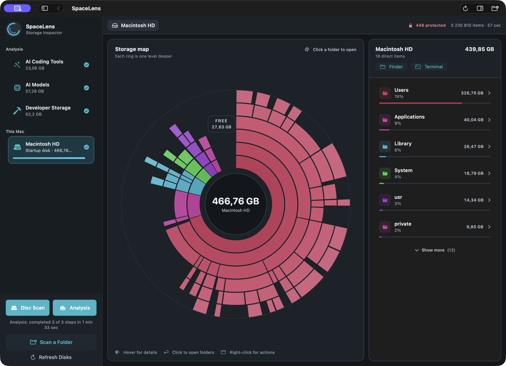
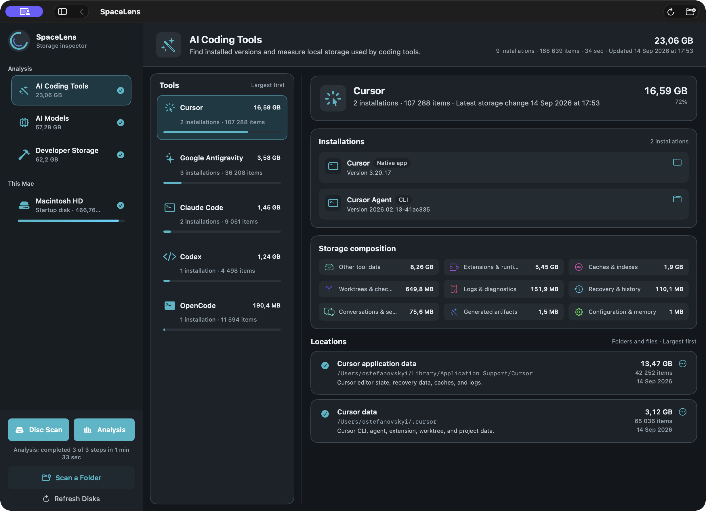
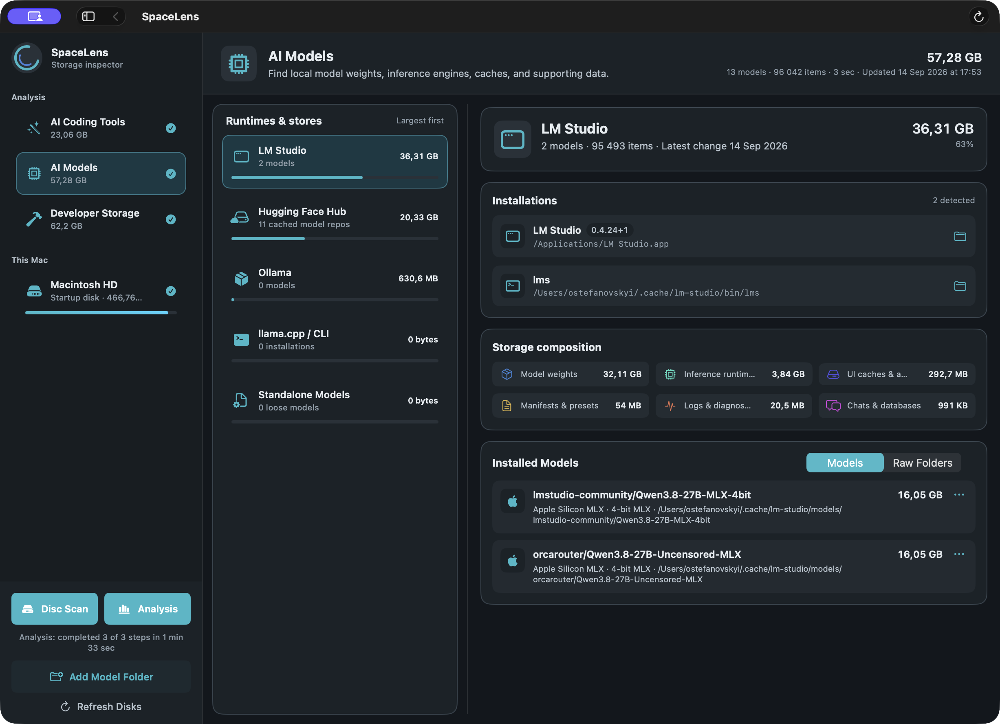

# SpaceLens


SpaceLens is a native, read-only macOS storage inspector. It maps disks and folders, then explains the space used by developer tooling and local AI software.

[](docs/images/spacelens-disk-overview.png)

## What it does

- Scans one folder, one disk, or every mounted local disk with cancellable, bounded parallel traversal.
- Turns completed scans into a drill-down sunburst and ranked list, including free disk capacity and protected-item reporting.
- Analyzes AI coding tools: Cursor, Claude Code, Codex, Google Antigravity, and OpenCode.
- Inventories Ollama, LM Studio, llama.cpp, Hugging Face Hub caches, and standalone GGUF or SafeTensors models.
- Breaks down Node.js/Web, Python, and Java/JVM storage into projects, tool-managed data, shared stores, and unattributed items.
- Keeps completed results for the app session and opens inspected locations in Finder or Terminal.

The chart supports hover details, click-to-drill navigation, breadcrumbs, context actions, keyboard navigation, and an accessible text alternative. Symbolic links are never followed, scans stay on the selected filesystem, and inaccessible locations do not abort the rest of a scan.

## Download a release

Download the latest disk image from [GitHub Releases](https://github.com/stefanovskyi/disk_inspection/releases/latest). Current release builds require macOS 14 or newer on Apple silicon. Open the `.dmg`, then drag **SpaceLens** onto **Applications**.

SpaceLens releases are currently ad-hoc signed and are not notarized. Before opening a download, compare its SHA-256 checksum with the value in the release notes:

```bash
shasum -a 256 ~/Downloads/SpaceLens-*.dmg
```

After moving `SpaceLens.app` to Applications, try to open it once. If macOS blocks it and you trust the downloaded file and its checksum, open **System Settings > Privacy & Security**, scroll to **Security**, click **Open Anyway**, then confirm **Open**. Apple documents this exception process in [Open a Mac app from an unknown developer](https://support.apple.com/guide/mac-help/mh40616/mac).

This exception does not make the app signed or notarized. Do not disable Gatekeeper globally. Developer ID signing and notarization are tracked in [issue #1](https://github.com/stefanovskyi/disk_inspection/issues/1).

## Analysis examples

<p>
  <a href="docs/images/spacelens-ai-coding-tools.png"></a>
  <a href="docs/images/spacelens-ai-models.png"></a>
</p>

These are unedited captures of completed results from the current app build—not scanning-progress or mockup screens. Totals naturally depend on the Mac being inspected.

## Run locally

Requirements: macOS 14 or newer and Swift 6 from Xcode or the Xcode Command Line Tools.

```bash
make app
open dist/SpaceLens.app
```

To build and open the native drag-and-drop installer:

```bash
make dmg
open dist/SpaceLens.dmg
```

SpaceLens checks for Full Disk Access before starting a scan or analysis so protected data is not silently omitted. Locally rebuilt, ad-hoc-signed apps may need permission again; [use a stable development signing identity](DEVELOPMENT.md#stable-permissions-for-local-builds) to avoid repeated prompts.

## Privacy and safety

SpaceLens never deletes, moves, or modifies scanned files. Its analyses read filesystem metadata and only the bounded manifests, configuration fields, and model headers needed for classification. They do not launch detected tools or package managers, and do not inspect source code, conversations, credentials, or model weights.

Build, test, packaging, signing, and benchmark instructions are in [DEVELOPMENT.md](DEVELOPMENT.md). Repository architecture and safety constraints are in [AGENTS.md](AGENTS.md).
