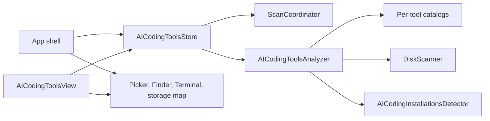

# AI coding tools feature boundary

Status: implemented  
Updated: 2026-09-10

The AI Coding Tools feature owns its domain model, tool catalogs, analysis engine, observable state, and views under `Sources/SpaceLens/Features/AICodingTools`. The app shell supplies system actions and coordinates access to the shared filesystem scanner resource.

## Ownership

| Area | Owner | Responsibility |
| --- | --- | --- |
| Domain | AI Coding Tools | Tool identity, installations and their evidence, storage locations, categories, progress, and reports |
| Catalogs | AI Coding Tools | One definition file per supported tool, including app IDs, CLI/package layouts, filesystem roots, and shared registry helpers |
| Analysis | AI Coding Tools | Shallow installation discovery, root normalization, overlap removal, storage measurement, classification, and report assembly |
| State | `AICodingToolsStore` | Analysis task, cancellation, stale-result protection, progress, selected tool, and project roots |
| UI | AI Coding Tools views | Filesystem-first result presentation and local interaction state |
| Navigation and system actions | App shell | Section selection, open panel, Finder, Terminal, and handoff to the general storage map |
| Expensive-work exclusivity | `ScanCoordinator` | Ensures a storage scan and AI analysis cannot run at the same time |

## Autonomy boundary

The feature autonomously starts, refreshes, cancels, and replaces its own analysis. It rejects late progress and results by operation ID, preserves the last completed report during refresh, chooses a valid default tool, and reruns when project-root inputs change.

The app shell remains responsible for decisions that affect the rest of SpaceLens. It chooses the active navigation section, presents macOS dialogs, performs Finder and Terminal actions, and converts a selected AI directory into a general storage scan. `ScanCoordinator` is the single shared seam between those two lifecycles.

Analysis remains explicitly user initiated. Opening the view does not scan automatically, and the feature does not run periodically or in the background. This keeps disk I/O predictable and preserves the existing privacy model.

Installation discovery runs beside the storage scan and reads only catalogued application manifests,
package manifests, manager receipts, command links, and shallow release layouts. It is bounded and
cancellable. It never launches a discovered binary, package manager, login shell, or network request.
Installation presence and storage presence remain independent in `AICodingToolReport`.

## Adding another coding tool

Cursor, Claude Code, Codex, Google Antigravity, and OpenCode each have one catalog file that returns an `AICodingToolDefinition` containing display metadata and filesystem roots. Register a new definition in `AICodingToolsCatalog`; the analyzer, store, and views consume definition records and do not need tool-specific branches.

Catalog changes can be developed and tested independently from view changes. Store changes can use an `AICodingToolsAnalyzing` test double, while analyzer tests can provide fixed root descriptors backed by temporary directories.
